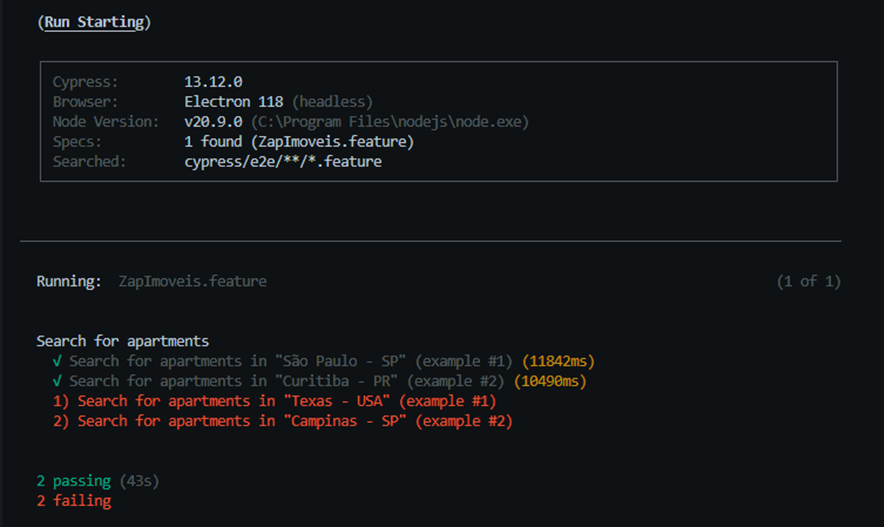

## 🚀 Teste de qualidade com Cypress automation 🚀

Neste hands-on, recebi a solicitação de testar um cenário, tendo como base o site do ZAP Imóveis, onde o usuário deveria realizar a seguinte ação:

<em>   Dado que estou na página inicial do portal ZAP imóveis
 Quando pesquiso uma cobertura para alugar na cidade de São Paulo
 E a cobertura deve aceitar Pets
 E deve estar pronta para morar
 Então a lista de resultados é mostrada
</em>

### ✨ Instalação e uso da arquitetura

---

- Instale o [Node.js](https://nodejs.org/en/download/);
- Baixe este repositório ou faça um git clone;
- Abra o diretório do projeto e execute o comando:
  - `npm install`
- Para abrir a interface de execução do Cypress, execute no diretório do projeto:
  - `npx cypress open`

OBS: Para garantia da aplicação recomendo utilizar o navegador Electron que já vem disponível no cypress!!

## 🔍 Camadas da arquitetura

---

- **fixtures:** nesse momento utilizo o SearchData para garantir que o resultado esperado das filtragens foi passado via url para a API
- **stepDefinitions:** diretório com os arquivos de testes solicitados;
- **pages:** diretório raíz com o site a ser testado e subdiretório com cada tela separadaradamente para validação;
- **features:** diretório a descrição de cada teste implementado;
- **environmentsConfig:** diretório com os arquivos de configuração por ambiente;
- **screenshots:** diretório com os arquivos de testes incluidos durante a execução;
- **node_modules:** arquivos ou diretórios que podem ser carregados pelo Node.js;
- **cypress.json:** arquivo de configuração do Cypress;
- **package-lock.json:** gerado automaticamente com as instalações e atualizações de pacotes;

### 💡 Cenários

---

- Neste projeto, temos dois testes onde o usuário busca por imóveis nas cidades de São Paulo e Curitiba e consegue realizar todo o fluxo de encontrar uma cobertura que aceite pets e esteja pronta para morar (mobiliada).   
- Temos dois testes negativos, onde o usuário busca por uma localidade inexistente na base "Texas - USA" e "Sidney - Austrália" sendo inviável a continuação do fluxo proposto  

### License

---

The MIT License. See the [license file](LICENSE) for details.

[CI BADGE]: https://github.com/jbenner-radham/node-readme-md/actions/workflows/ci.yaml/badge.svg
[CI PAGE]: https://github.com/jbenner-radham/node-readme-md/actions/workflows/ci.yaml
[LICENSE BADGE]: https://img.shields.io/badge/license-MIT%20License-blue.svg
[LICENSE PAGE]: https:/olx.com.br/
[NODE PAGE]: https://nodejs.org/
[NODE VERSION BADGE]: https://img.shields.io/node/v/readme-md.svg
[NPM PAGE]: https://www.npmjs.com/package/readme-md
[NPM VERSION BADGE]: https://img.shields.io/npm/v/readme-md.svg
